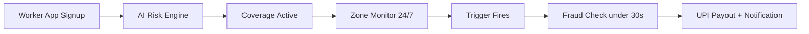
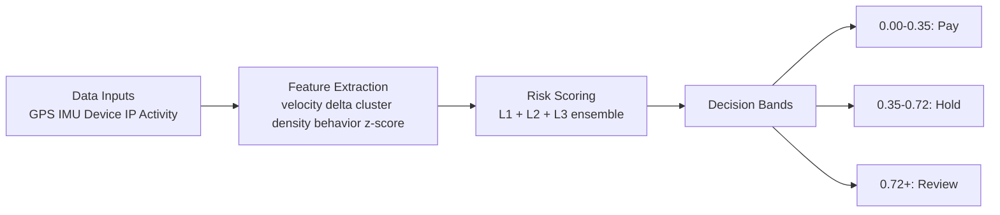
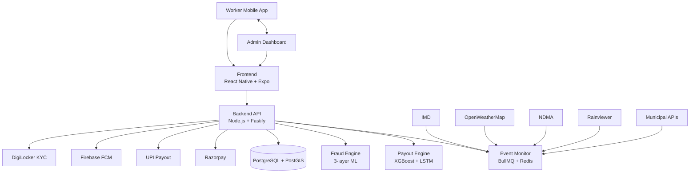

# GigShield - Phase 1

Free, automatic insurance for delivery workers. Payouts are triggered by rain, heat, curfew, flood, and cyclone conditions. No claim forms. No manual processing. Money can be sent in about 15 minutes.

## Live UI

- Full page UI: https://tripadh.github.io/DEVTRAILS_HACKATHON/
- Source page: `index.html`

## 01) Problem

Delivery workers lose income whenever weather or curfew events block operations.

| Metric | Value |
|---|---:|
| Gig delivery workers in India | 12M+ |
| Workers disrupted monthly | 47% |
| Average monthly income loss | INR 2,400 |
| Existing parametric products for this segment | 0 |

## 02) Solution

GigShield detects disruption events automatically and pays workers instantly based on transparent thresholds.

- Traditional model: worker proves harm, waits for approval.
- GigShield model: system detects event, validates zone and risk, triggers UPI payout.
- Worker cost: INR 0.

## 03) Persona

**Ravi Kumar, 28, Bengaluru rider**

- Works on food delivery apps across South Bengaluru.
- Faces 3-4 disruption days per month.
- Typical loss per heavy rain day: INR 500-700.
- Needs immediate liquidity, not delayed reimbursements.

## 04) System Workflow

### Worker sees

1. OTP signup and delivery account linking.
2. UPI linking and zone setup.
3. Coverage active immediately.
4. Notification plus automatic payout when event fires.

### System does

1. Poll weather and disaster feeds every 15 minutes by zone.
2. Match active covered workers in affected geohashes.
3. Run 3-layer anti-fraud scoring.
4. Execute payout through payment rail.

## 05) Parametric Triggers

| Event | Threshold | Typical Payout | Data Source |
|---|---|---:|---|
| Heavy Rain | >= 65 mm/hr for 30+ min | INR 300-500 | IMD + OpenWeatherMap + Rainviewer (2-source agreement) |
| Extreme Heat | Feels-like >= 42 C for 2+ hrs | INR 300-500 | IMD Heat Advisory + OWM Heat Index |
| Curfew | Official government order in worker zone | INR 400-600 | NDMA feeds + state disaster portals |
| Urban Flood | Municipal flood alert in ward/zone | INR 500-700 | Municipal APIs (for example BBMP/GHMC/BMC) |
| Cyclone | IMD Cat-1+ within 200 km | INR 600-900 | IMD Cyclone Warning Centre + RSMC |

## 06) Coverage Model

Workers are fully covered at no cost.

- Worker pricing: INR 0.
- Funding model: platform-sponsored B2B welfare coverage.
- Payout ceiling target: up to INR 800/event (policy and trigger dependent).

### Revenue channels

1. Platform partnerships (per enrolled worker fee).
2. Aggregated disruption intelligence products for logistics planning.
3. CSR/ESG-aligned welfare programs.

## 07) AI / ML Systems

| System | Purpose | Core Methods |
|---|---|---|
| Payout Scoring | Dynamic payout by zone severity and event intensity | XGBoost, LSTM, geospatial features |
| Fraud Detection | Multi-layer spoofing and ring detection | DBSCAN, Louvain graph methods, time-series anomaly logic |
| Forecasting | 48-hour disruption probability by zone | Random Forest + historical weather patterns |
| Retention | Re-engagement risk prediction | Logistic regression + behavioral signals |

## 08) Anti-Spoofing Defense

Three independent layers run together. A spoofing attempt must bypass all three to pass.

### Layer 1: Device signal checks (sub-second)

- IMU vs GPS consistency
- GNSS quality checks
- Mock location detection
- Cell tower and Wi-Fi coherence

### Layer 2: Behavior checks (2-5s)

- Work-hour baseline deviation
- Zone history consistency
- Active delivery session validation
- Device continuity checks

### Layer 3: Network ring checks (10-30s)

- DBSCAN spatial clustering
- Louvain graph communities
- Shared IP/ASN fingerprints
- Burst claim behavior

Replay protection: each location proof uses nonce + timestamp validation.

## 09) Fraud Detection Pipeline

Target quality objective: keep legitimate users routed to review under 2%.

## 10) Tech Stack

| Layer | Technology | Why |
|---|---|---|
| Mobile | React Native (Expo) + Zustand | One codebase for iOS and Android with device-sensor access |
| Backend | Node.js + Fastify + BullMQ + Redis | Event-driven payouts and async fraud jobs |
| Database | PostgreSQL + PostGIS | Efficient geospatial queries |
| AI/ML | Python + FastAPI + XGBoost + NetworkX + MLflow | Model serving, graph analysis, retraining workflow |
| Weather/Alerts | IMD + OpenWeatherMap + NDMA + Rainviewer | Multi-source validation before trigger firing |
| Payments | Razorpay + UPI + DigiLocker | Payout rail + onboarding/KYC workflow |
| Auth/Push | Firebase Auth (OTP) + FCM | Standard mobile login and real-time notifications |
| Infra | AWS + Cloudflare + GitHub Actions | Managed scale, security, CI/CD |

## 11) System Architecture

## 12) UX Flow

| Step | Screen | User Action |
|---:|---|---|
| 1 | Register | OTP login, link gig account, set zone, link UPI |
| 2 | Covered | Coverage starts instantly at zero cost |
| 3 | Work Normally | App monitors silently while status remains protected |
| 4 | Get Paid | Push notification + SMS + payout to UPI |

Accessibility and reliability focus:

- Hindi and English support
- Low-connectivity resilience with fallback notifications

## 13) Why It Is Strong

1. Fully automated payout operation.
2. Multi-layer fraud resistance.
3. B2B-aligned scalable economics.
4. Low literacy barrier to use.
5. Transparent trigger thresholds.
6. India-native rails and data integrations.

## 14) Roadmap

| Timeline | Milestone | Outcome |
|---|---|---|
| Phase 2 (Apr 2025) | Full ML stack live | Real fraud detection, first real payouts, Bengaluru pilots |
| Phase 3 (May 2025) | Scale + fleet tooling | Layer-3 live, multi-city rollout, operator dashboard |
| Post-hackathon | Platform expansion | AQI trigger, regulatory sandbox path, B2B API expansion |

## Quick Links

- Live UI: https://tripadh.github.io/DEVTRAILS_HACKATHON/
- Repository: https://github.com/Tripadh/DEVTRAILS_HACKATHON

---

GigShield | Phase 1 | Parametric Insurance for Gig Delivery Workers
