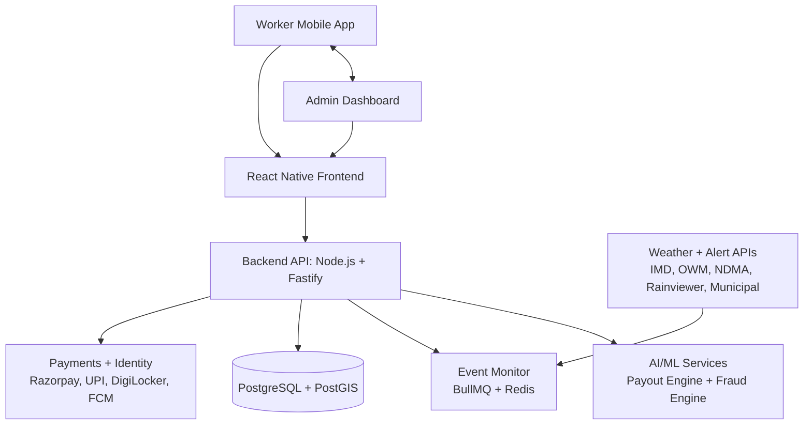

# 🛡️ GigShield
### AI-powered parametric insurance for gig delivery workers
> Free, automatic payouts when rain, heat, or curfews make work impossible - no claims, no forms, money in 15 minutes.

[](https://github.com/Tripadh/DEVTRAILS_HACKATHON)
[](https://github.com/Tripadh/DEVTRAILS_HACKATHON)
[](https://github.com/Tripadh/DEVTRAILS_HACKATHON)
[](https://github.com/Tripadh/DEVTRAILS_HACKATHON)

 🎨 **[Figma Prototype](#figma-prototype-link)** | 📹 **[2-min Video](#two-min-video-link)** | 🌐 **[Full UI Page](https://tripadh.github.io/DEVTRAILS_HACKATHON/)**

---

## 📋 Table of Contents

| # | Section |
|---|---------|
| 01 | [Problem Statement](#01--problem-statement) |
| 02 | [Our Solution](#02--our-solution) |
| 03 | [Persona Definition](#03--persona-definition) |
| 04 | [System Workflow](#04--system-workflow) |
| 05 | [Parametric Triggers](#05--parametric-triggers) |
| 06 | [Coverage Model](#06--coverage-model) |
| 07 | [AI / ML Architecture](#07--ai--ml-architecture) |
| 08 | [Anti-Spoofing Defense](#08--anti-spoofing-defense) |
| 09 | [Fraud Detection Pipeline](#09--fraud-detection-pipeline) |
| 10 | [Tech Stack](#10--tech-stack) |
| 11 | [System Architecture](#11--system-architecture) |
| 12 | [UX Design Flow](#12--ux-design-flow) |
| 13 | [Why Our Solution is Strong](#13--why-our-solution-is-strong) |
| 14 | [Future Scope](#14--future-scope) |

---

<a id="01--problem-statement"></a>
## 01 - Problem Statement

India's 12 million gig delivery workers lose income every time it rains, overheats, or a curfew drops. There is no insurance product designed for this. Filing a traditional claim takes weeks and usually gets rejected.

| Stat | Value |
|------|-------|
| 🛵 Gig delivery workers in India | **12 million+** |
| ⚠️ Experience monthly disruptions | **47%** |
| 💸 Average monthly income lost | **INR 2,400** |
| 🚫 Existing parametric insurance products for them | **Zero** |

**The gap:** When a monsoon hits Bengaluru or a curfew drops in Hyderabad, these workers lose the day with no safety net and no product built for their reality.

---

<a id="02--our-solution"></a>
## 02 - Our Solution

GigShield is a **free, mobile-first parametric insurance platform** that automatically detects external disruptions and pays workers directly to their UPI accounts, with no forms, no adjusters, and no waiting.

> **Key innovation:** Traditional insurance = worker proves harm -> waits weeks.  
> GigShield = system detects event -> pays in **15 minutes**.

**How it's funded:** Platform partners (Swiggy, Zomato, Zepto) pay GigShield per enrolled worker as a welfare benefit. Workers pay **INR 0**.

---

<a id="03--persona-definition"></a>
## 03 - Persona Definition

### 🛵 Ravi Kumar, 28 - Food Delivery Rider, South Bengaluru

| Income Pattern | Daily Life | Pain Points |
|----------------|------------|-------------|
| INR 700-900/day normally | 10-12 hrs, 6 days/week | INR 500-700 lost per rain day |
| Drops 70% on rain days | 18-22 deliveries/day | 3-4 disruption days/month |
| No paid leave or savings | Loses full day in heavy rain | Insurance claim rejected before |
| Sends INR 8,000/month home | Uses UPI for everything | Cannot afford annual premiums |

**Ravi's GigShield moment:**
> Rain hits Bengaluru. Before he decides whether to ride or wait, his phone buzzes.  
> *"Heavy rain in your zone. INR 400 payout sent."*  
> He filed nothing. Called no one.

---

<a id="04--system-workflow"></a>
## 04 - System Workflow

### End-to-end flow

```text
Worker App -> AI Risk Engine -> Coverage Live -> Zone Monitor -> Trigger Fires -> Fraud Check -> UPI Payout ✓
  (Signup)     (Zone+profile)   (Instant,free)  (Weather 24/7) (Threshold ✓)   (<30 sec)     (Notified)
```

### What the worker sees

```text
1. Sign up with OTP -> link delivery account + UPI ID
2. Coverage active immediately -> no payment needed
3. App shows status: Protected / Checking / Payout processing
4. Push notification + UPI transfer -> fully automatic
```

### What the system does

```text
A. Polls weather APIs every 15 min per geohash zone (~1.2km2)
B. Matches affected zones to all active covered workers
C. Runs 3-layer fraud check in under 30 seconds
D. Dispatches UPI payout via Razorpay
```

---

<a id="05--parametric-triggers"></a>
## 05 - Parametric Triggers

All payouts are triggered by **verifiable, external data** and not worker claims. Every trigger requires **2+ independent sources** to agree before firing.

| Event | Threshold | Payout | Data Source |
|-------|-----------|--------|-------------|
| 🌧️ Heavy Rain | >= 65mm/hr sustained 30+ min | INR 300-500 | IMD + OpenWeatherMap + Rainviewer |
| 🌡️ Extreme Heat | Feels-like >= 42C for 2+ hrs (11am-4pm) | INR 300-500 | IMD Heat Advisory + OWM Heat Index |
| 🚫 Curfew / Shutdown | Official government order in worker zone | INR 400-600 | NDMA + state disaster portals |
| 🌊 Urban Flooding | Municipal flood alert for ward/zone | INR 500-700 | BBMP / GHMC / BMC municipal APIs |
| 🌀 Cyclone Warning | IMD Category 1+ within 200km | INR 600-900 | IMD Cyclone Centre + RSMC |

> **Cross-validation rule:** Trigger fires only when at least two independent data sources confirm the same threshold breach.

---

<a id="06--coverage-model"></a>
## 06 - Coverage Model

### 🎁 100% free for every gig delivery worker

| Included benefit |
|------------------|
| ✅ Sign up once, covered immediately |
| ✅ All 5 triggers covered |
| ✅ Payouts up to INR 800 per event |
| ✅ No plans, no tiers, no catch |

### How it is funded (B2B revenue model)

| Source | How it works |
|--------|--------------|
| 🏢 **Platform Partnerships** | Swiggy / Zomato / Zepto pay per enrolled worker as welfare coverage |
| 📊 **Anonymized Data** | Aggregated disruption insights for logistics route planning |
| 🤝 **CSR / ESG Funding** | Worker welfare programs aligned with ESG reporting |

---

<a id="07--ai--ml-architecture"></a>
## 07 - AI / ML Architecture

Four purpose-built ML systems, each solving one specific problem.

### 1) 💰 Payout Scoring Engine
Calculates exact payout per event using zone severity, weather intensity, and geohash disruption history.

**Models:** `XGBoost`, `LSTM`, `Geohash feature encoding`

### 2) 🛡️ Fraud Detection (3-layer)
Detects GPS spoofing, coordinated fraud rings, and fake accounts in under 30 seconds.

**Models:** `DBSCAN clustering`, `Louvain community detection`, `ARIMA + LSTM behavioral model`

### 3) 🔮 Disruption Forecasting
Provides 48-hour risk forecasts per geohash cell to help workers and partners plan.

**Models:** `Random Forest`, `IMD historical data`, `Geohash spatial encoding`

### 4) 📉 Worker Retention Model
Predicts drop-off risk and sends personalized nudges based on zone risk and engagement signals.

**Models:** `Logistic Regression`, `Engagement event features`, `A/B-tested notification variants`

---

<a id="08--anti-spoofing-defense"></a>
## 08 - Anti-Spoofing Defense

GPS spoofing is the primary fraud vector. GigShield uses **3 independent layers** and a fraud ring must defeat all three.

```text
Layer 1 (Device, <500ms): IMU vs GPS, GNSS quality, mock location flags, cell/wifi consistency
Layer 2 (Behavior, 2-5s): Work-hour baseline, zone history, active session checks, device continuity
Layer 3 (Network, 10-30s): DBSCAN clusters, Louvain communities, shared IP/ASN, claim burst detection
```

> 🔒 **Replay protection:** Every GPS report is signed with nonce + timestamp so past valid traces cannot be replayed.

---

<a id="09--fraud-detection-pipeline"></a>
## 09 - Fraud Detection Pipeline

```text
Data Inputs -> Feature Extraction -> Risk Scoring -> Decision Engine -> Outcome
GPS/IMU/IP/activity -> behavior+cluster features -> L1+L2+L3 ensemble -> Pay/Hold/Review -> UPI/Hold/Manual
```

Decision bands:
- `0.00-0.35` -> PAY
- `0.35-0.72` -> HOLD
- `0.72-1.00` -> REVIEW

**Target:** under 2% of legitimate workers reach manual review.

---

<a id="10--tech-stack"></a>
## 10 - Tech Stack

| Layer | Technology | Why |
|-------|------------|-----|
| 📱 **Mobile** | React Native (Expo) + Zustand | Single iOS + Android codebase with GPS/IMU access |
| ⚙️ **Backend** | Node.js + Fastify + BullMQ + Redis | Async fraud jobs do not block payouts |
| 🗄️ **Database** | PostgreSQL + PostGIS | Geospatial zone queries |
| 🧠 **AI / ML** | Python + FastAPI + XGBoost + NetworkX + MLflow | Fraud graphs + model lifecycle tracking |
| 🌦️ **Weather APIs** | IMD + OpenWeatherMap + NDMA + Rainviewer | 2+ source validation before trigger fire |
| 💳 **Payments** | Razorpay + UPI + DigiLocker | Instant payout rail + KYC support |
| 🔔 **Auth / Push** | Firebase Auth (OTP) + Firebase FCM | Fast login + real-time payout notifications |
| ☁️ **Infra** | AWS + Cloudflare + GitHub Actions + Sentry | Scale, protection, CI/CD, and observability |

---

<a id="11--system-architecture"></a>
## 11 - System Architecture



---

<a id="12--ux-design-flow"></a>
## 12 - UX Design Flow

```text
[1 Register] -> [2 Covered] -> [3 Work Normally] -> [4 Get Paid]
```

Design principles:
- 🇮🇳 Hindi + English, zero insurance jargon
- 📶 Low-connectivity resilience with notification fallback
- 🧭 Transparent payout explanations
- 🤝 Non-accusatory review messaging

---

<a id="13--why-our-solution-is-strong"></a>
## 13 - Why Our Solution Is Strong

| # | Strength | Why it matters |
|---|----------|----------------|
| ⚡ | **Fully Automated** | 95%+ payouts with zero human intervention |
| 🛡️ | **Fraud-Resistant** | 3 independent layers catch coordinated abuse |
| 📈 | **Scalable Business** | B2B model scales with worker enrollment |
| 🎯 | **Low Literacy Barrier** | Auto-enrolled, auto-paid experience |
| 🔍 | **Transparent** | Threshold logic visible and explainable |
| 🇮🇳 | **India-Native** | IMD, UPI, DigiLocker, bilingual UX |

---

<a id="14--future-scope"></a>
## 14 - Future Scope

### Phase 2 - April 2025
- Full ML fraud stack deployed
- First real UPI payouts to pilot workers
- Layers 1 and 2 anti-spoofing in production
- Live user testing in Bengaluru

### Phase 3 - May 2025
- Layer 3 network fraud ring detection live
- Multi-city rollout (Bengaluru -> Chennai -> Mumbai)
- Fleet operator dashboard
- Automated retraining pipeline

### Post-hackathon
- AQI trigger for winter pollution events
- Regulatory sandbox progression
- B2B API for gig platform integrations
- Satellite imagery checks for flood validation
- Direct delivery platform session-proof integration

---

## 📁 Repository Structure

```text
DEVTRAILS_HACKATHON/
├── README.md
└── index.html
```

---

## 👥 Team

Built for the GigShield Hackathon - Phase 1 Submission (March 2025).

---

## Links To Be Added

<a id="figma-prototype-link"></a>
- Figma Prototype: coming soon

<a id="two-min-video-link"></a>
- 2-min Video: coming soon

---

*GigShield - Parametric Insurance for Gig Delivery Workers - India - 2025*
